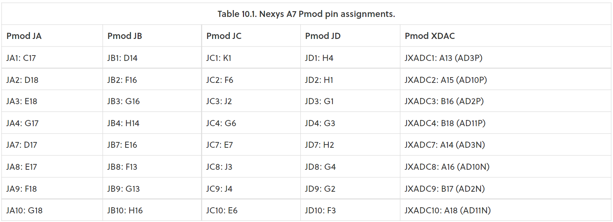

Preparation tasks (done before the lab at home):

1. See schematic or reference manual of the Nexys A7 board and find out the connection of two RGB LEDs, ie to which FPGA pins are connected and how. How you can control them to get red, yellow, or green colors? Draw the schematic with RGB LEDs.

2. See schematic or reference manual of the Nexys A7 board and find out to which FPGA pins Pmod ports JA, JB, JC, and JD are connected.
 
